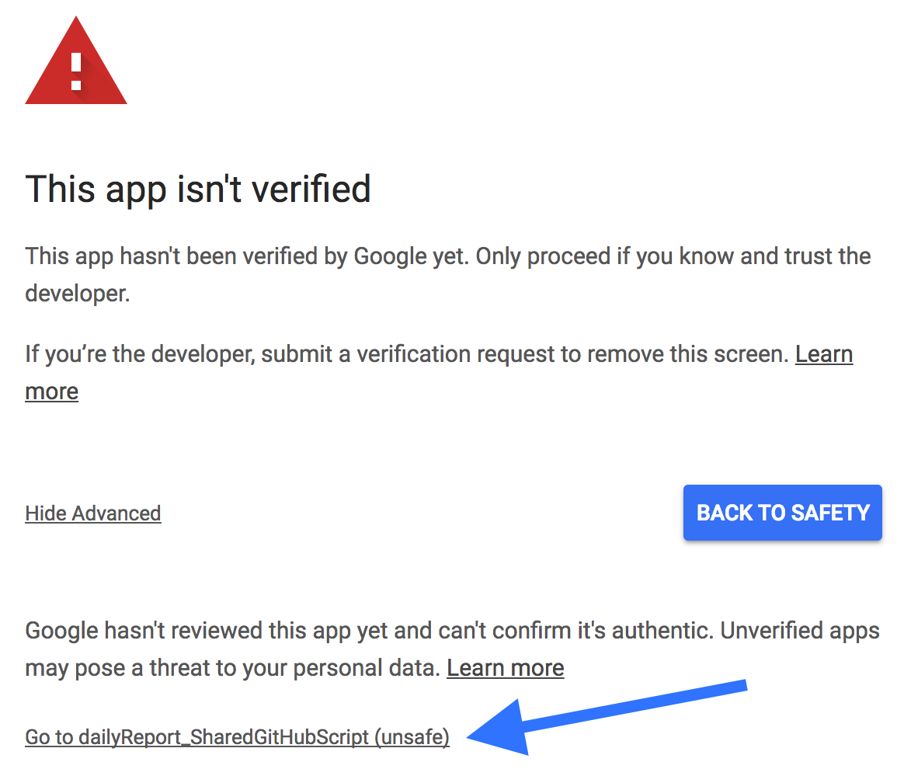

# <u>Overview</u>
This script cross-references data between different tabs in a Google spreadsheet, removes the undesired data, and stores the desired data.

# <u>Initial Setup</u>

### Template Sheet
You will need a Google account to run this program. Navigate to my <a style="color:#0D6EE4" href="https://drive.google.com/open?id=0B5w_Rm6Jrg-PRGpJOEpaWFo3bmc">reformatGoogleSheetsData_DailyReports</a> folder. Right click the <i>dailyReport_SharedGitHub</i> file, and select <i>Add to My Drive</i>. This will create a copy of the file in your google drive.

### Script Editor
Open the file from your drive and navigate to the menu bar. Click <i>tools</i> and select <i>Script editor</i>. A new tab should open in the browser titled <i>dailyReport_SharedGitHubScript</i> and it should have three files labeled:
1. <i>code.gs</i>
2. <i>docInfo.gs</i>
3. <i>reusableFunctions.gs</i>

If you can't locate these files, create them, and copy/paste the corresponding scripts located in this <i>GitHub</i> repository.

### Example Data
The spreadsheet has example data in place to see how the code operates. Notice the number of rows within each tab:

|Tab|Number of Rows|
|----|----|
|<i>Daily Report</i>:|100|
|<i>Accounts</i>:|175|
|<i>User Update</i>:|200|

One of the functions this program offers is it updates the data in both the <i>Accounts</i> and <i>User Update</i> tabs. It does this by comparing the information in both tabs with the information in the <i>Daily Report</i> tab. Notice what will happen to the number of rows within each tab after running the function that updates the report:

|Tab|Number of Rows|
|----|----|
|<i>Daily Report</i>:|100|
|<i>Accounts</i>:|100|
|<i>User Update</i>:|100|

### Run the Search
The first time you try to run this app, <i>Google</i> will inform you the app must be approved. Select this <a style="color:#0D6EE4" href="https://support.google.com/cloud/answer/7454865">Google clould help link</a> to learn how to verify the app. You can bypass the previous process by following these steps:

1. Navigate to the menu bar, click <i>Reporting</i>, and select <i>Update Reports</i>
 

 

2. A pop-up will appear letting you know authorization is required. Click the button labeled <i>Continue</i>.
 

 

3. Select the link labeled <i>Advanced</i>. Then select the <i>Google</i> account you wish to use.
 

 

4. Click the link at the bottom. It should be labeled with the name of the script being used to run this app. Unless you rename the script it should be labeled as <i>dailyReport_SharedGitHubScript</i>.
 

 

5. Type the word <i>Continue</i> in the text box and click <i>NEXT</i>.
 

 

6. Once verified, the app should run. But, if it doesn't, repeat step 1 and that should do the trick.

### Modify the script

Look at the following notes to make modifications that will meet your needs:

* To rename the spreadsheet tab names:
   
   
  * Click the drop-down icon on the tab that will be renamed, then click <i>Rename</i>.
   
  
   
   
  * Navigate to the menu bar. Click <i>tools</i> and select <i>Script editor</i>. A new tab should open in the browser titled <i>dailyReport_SharedGitHubScript</i>. Open the file labeled <i>reusableFunctions.gs</i>. Locate the <i>constants</i> object and rename the values for the corresponding keys for each sheet name.
   
   
* To modify the script:
   
   
  * Navigate to the menu bar. Click <i>tools</i> and select <i>Script editor</i>. Open the file labeled <i>docInfo.gs</i>.
   
   
  * Locate the <i>accountsReport</i> function. This function accepts one arguement (i.e. data from the <i>Daily Reports</i> tab), and modifies data in the <i>Accounts</i> tab.
   
   
  * Locate the <i>userUpdateReport</i> function. This function accepts one arguement (i.e. data from the <i>Daily Reports</i> tab), and modifies data in the <i>User Update</i> tab.
